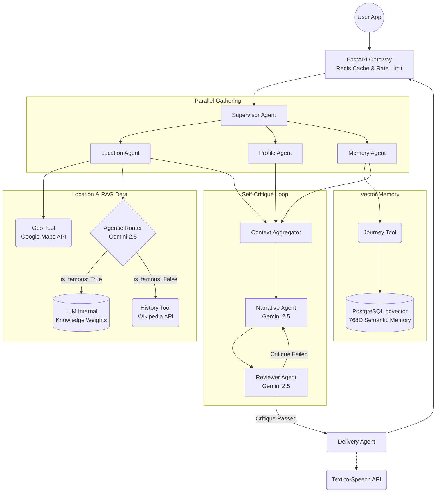

# Nomad Notes

Nomad Notes is a highly advanced, multi-agent AI travel platform that acts as a hyper-personalized historical tour guide. Traditional travel apps give you static, generic information. Nomad Notes changes that by using a custom Agent Development Kit (ADK) to coordinate a team of specialized AI agents—powered by Google's **Gemini 2.5 Flash**.

When a user visits a location, the backend instantly fetches their GPS coordinates and uses **Agentic RAG** to gather live context from Google Maps and Wikipedia. It also uses **Vector Semantic Memory** via PostgreSQL (`pgvector`) to recall the user's past travels so the AI can draw personalized analogies. Finally, the story is written and run through a strict, autonomous self-critique loop to ensure safety and accuracy. It's all orchestrated on a high-performance Python FastAPI backend, protected by Redis for rate-limiting and caching.

## 🚀 Key Features
- **Hyper-Personalization:** Tailors narratives based on user demographics and past trips.
- **Agentic RAG Routing:** Dynamically evaluates whether to fetch external data (Wikipedia) or rely on internal LLM knowledge, drastically reducing latency.
- **Semantic Memory (Vector RAG):** Translates past user journeys into 768-dimensional vector embeddings to draw poetic analogies (e.g., comparing Roman ruins in France to ones seen in Italy).
- **Autonomous Self-Critique:** A "Reviewer Agent" critiques generated stories against strict JSON schemas, forcing rewrites before the user ever sees the text.
- **Gateway Defense:** Redis-backed 15 RPM fixed-window rate limiting and 24-hour request caching.

## 🛠 Technology Stack
- **Orchestration:** Custom Python ADK (Agent Development Kit) utilizing native `asyncio`.
- **Backend:** FastAPI (Python 3.12) / Uvicorn.
- **LLM Engine:** Google Gemini (`gemini-2.5-flash`) via `google-genai` SDK.
- **Embedding Engine:** Google Gemini (`gemini-embedding-2`) configured for `output_dimensionality=768`.
- **Primary Database:** PostgreSQL 16 (`asyncpg` / `sqlalchemy[asyncio]`).
- **Vector Database:** PostgreSQL `pgvector` extension (L2 distance semantic search).
- **State & Caching:** Redis (`redis.asyncio`).
- **External Data APIs:** Google Maps API, Wikipedia/Wikidata REST APIs.

## 🧠 System Architecture

The `/generate` endpoint triggers the `SupervisorAgent`, which coordinates a complex execution graph:



## 📜 API Contract

`POST /generate`

**Request:**
```json
{
  "user_id": "1",
  "latitude": 18.5196,
  "longitude": 73.8553
}
```

**Response:**
```json
{
  "request_id": "123e4567-e89b-12d3-a456-426614174000",
  "place": "Shaniwar Wada",
  "text": {
    "title": "Shaniwar Wada - Peshwa Era",
    "story": "..."
  },
  "safe": true
}
```

## 💻 Local Development & Usage

### 1. Run via Docker Compose (Recommended)
Spins up PostgreSQL, pgvector, and Redis automatically.
```bash
docker compose up --build
```

### 2. Run API Server Locally
```bash
uvicorn api.main:app --reload
```

### 3. Run Tests
```bash
python -m pytest tests/
```

### 4. Test the Endpoint
```bash
curl -X POST http://localhost:8000/generate \
  -H "Content-Type: application/json" \
  -d "{\"user_id\":\"1\",\"latitude\":18.5196,\"longitude\":73.8553}"
```

## ⚙️ Configuration
Copy `.env.example` to `.env` and provide real credentials (`GOOGLE_API_KEY`, etc.) before enabling production integrations.

**Local Auth Bypass:**
For local development without Firebase credentials, set `LOCAL_AUTH_BYPASS=true` in `.env`. This skips JWT verification and assigns a test user. It is environment-gated and strictly disabled in production.
